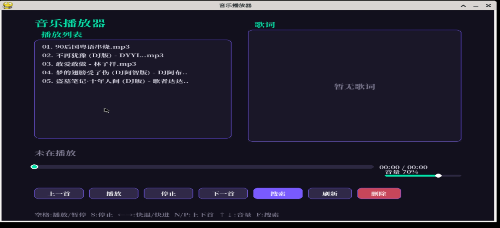
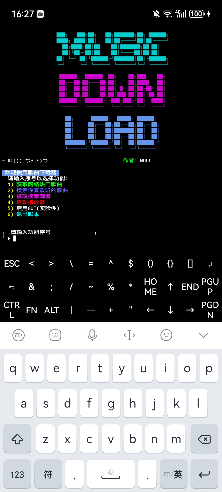

# Termux 音乐播放器

一个跑在 Termux / Android 上的音乐播放器，带 TUI（curses）和 GUI（pygame）两种界面。





## 项目简介

这是一个在手机上用 Python 写的小型音乐播放器。最初的目的是在 Termux 里也能方便地听本地音乐、看歌词、偶尔在线搜一下想听的歌。后来慢慢加上了 GUI、在线搜索、下载、删除、配置持久化等功能，代码也从一个单文件脚本长成了现在这个结构。

它不追求功能全面，也不打算替代任何专业播放器。它只是一个能跑、能用、自己看着顺眼的小工具。如果你也在 Termux 上折腾 Python，也许能从中找到一点可复用的东西。

## 特点

- **开箱即用**：直接 `python music_player.py` 运行，依赖会自动安装，不用手动 `pip install`
- **双界面**：TUI 用 curses，适合纯终端；GUI 用 pygame，有背景图、进度条、搜索面板
- **歌词同步**：读取同名 `.lrc` 文件，支持二分查找，长歌词也不卡
- **在线搜索**：内置搜索面板，可调搜索阈值，选中后一键下载歌曲和歌词
- **播放列表**：支持滚动、鼠标点击、滚轮
- **删除功能**：删除歌曲时连同同名 `.lrc` 一起删，带确认弹窗
- **背景自定义**：GUI 支持背景图、蒙层暗度、面板透明度
- **配置持久化**：首次运行自动生成 `.conf` 配置文件，改完重启生效
- **完整日志**：START / INFO / WARN / ERROR 四级日志，带颜色，方便排查

## 界面预览

### GUI

GUI 版是给喜欢视觉反馈的人准备的。左侧是播放列表，右侧是歌词框，下方是进度条、音量条和一排控制按钮。背景可以换成任意图片，面板透明度可调，配色全部走配置文件。

" 可以使用ffmpeg转换pygame不支持的格式 https://github.com/BtbN/FFmpeg-Builds/releases/download/latest/ffmpeg-n8.1-latest-win64-lgpl-shared-8.1.zip"

### TUI

TUI 版是给纯终端环境准备的。不用 X 服务器，不用显示服务器，只要能跑 curses 就能用。适合在 SSH 里、在 tmux 里、在那种没有图形界面的环境下听歌。

## 环境要求

- Termux（Android）或任意带 Python 3.10+ 的环境
- 首次运行时脚本会检测并自动安装 `pygame`、`requests` 等依赖

如果自动安装失败（比如网络问题），可以手动装：

```bash
pkg install python
pip install pygame requests
```

配置
配置文件格式是简单的 key=value，music_player.conf.example 是一份默认模板，可以直接复制成 music_player.conf 使用。

基础项
项	说明	默认值
MUSIC_DIR	音乐目录	/storage/emulated/0/Music
window_title	GUI 窗口标题	音乐播放器
window_icon	GUI 窗口图标路径，留空用默认	空
背景与面板
项	说明	默认值
bg_image	GUI 背景图路径，留空不用图片	空
bg_dim	背景蒙层暗度 0~255，越大越暗	120
panel_alpha	面板透明度 0~255，255 完全不透明	180
字体
项	说明	默认值
FONT_TITLE	标题字体路径	fonts/NotoSerifCJK-Bold.ttc
FONT_NORM	常规字体路径	fonts/NotoSerifCJK-Bold.ttc
FONT_SMALL	小号字体路径	fonts/NotoSerifCJK-Bold.ttc
F_TITLE_SIZE	标题字号	26
F_NORM_SIZE	常规字号	19
F_SMALL_SIZE	小号字号	14
配色
所有颜色项格式为 R,G,B，比如 C_BG=18,16,28。

项	说明	默认值
C_BG	主背景色	18,16,28
C_PANEL	面板底色	30,27,45
C_PANEL2	次级面板底色	38,34,56
C_ACCENT	主强调色（青绿）	0,230,170
C_ACCENT2	次强调色（紫）	120,90,255
C_TEXT	正文文字色	228,226,240
C_DIM	次要文字色	130,126,150
C_BTN	按钮底色	48,42,72
C_BTN_HOV	按钮悬停色	70,60,105
C_BAR_BG	进度条底色	45,40,65
C_BAR_FILL	进度条填充色	0,230,170
C_SEL	选中项底色	60,48,110
C_WHITE	白色	255,255,255
C_DANGER	危险操作色（红）	200,70,90
坐标与尺寸
项	说明	默认值
BAR_X / BAR_Y / BAR_W / BAR_H	进度条位置和尺寸	60 / 470 / 620 / 12
VOL_X / VOL_Y / VOL_W	音量条位置和尺寸	700 / 500 / 140
LIST_X / LIST_Y / LIST_W / LIST_H	播放列表位置和尺寸	60 / 90 / 360 / 300
LYRIC_X / LYRIC_Y / LYRIC_W / LYRIC_H	歌词框位置和尺寸	450 / 60 / 390 / 340
配置文件示例
ini
MUSIC_DIR=/storage/emulated/0/Music
window_title=音乐播放器
window_icon=
bg_image=/storage/emulated/0/Pictures/bg.jpg
bg_dim=140
panel_alpha=160

FONT_TITLE=fonts/NotoSerifCJK-Bold.ttc
FONT_NORM=fonts/NotoSerifCJK-Bold.ttc
FONT_SMALL=fonts/NotoSerifCJK-Bold.ttc
F_TITLE_SIZE=26
F_NORM_SIZE=19
F_SMALL_SIZE=14

C_BG=18,16,28
C_PANEL=30,27,45
C_ACCENT=0,230,170
C_ACCENT2=120,90,255
C_TEXT=228,226,240
C_DANGER=200,70,90

BAR_X=60
BAR_Y=470
BAR_W=620
BAR_H=12
操作
GUI
按键 / 操作	功能
空格	播放 / 暂停
S	停止
← →	快退 / 快进 5 秒
N / P	下一首 / 上一首
↑ ↓	音量增减
F	打开搜索面板
Esc	退出
点击列表	播放对应歌曲
点击进度条	跳转到对应位置
点击音量条	调整音量
拖动滚动条	列表 / 搜索结果滚动
滚轮	列表滚动
搜索面板
操作	功能
输入文字	关键词
回车	搜索（结果为空时）/ 下载（有结果时）
↑ ↓	选择结果
滚轮	结果列表滚动
清空	清空输入和结果，恢复搜索状态
阈值	修改搜索条数（默认 30）
搜索 / 下载	根据当前状态自动切换
取消	关闭面板
TUI
按键	功能
↑ ↓	选择歌曲
回车	播放
空格	播放 / 暂停
D	删除选中歌曲
R	刷新列表
Q	退出
歌词
歌词文件使用标准 .lrc 格式，和音频文件同名同目录。比如：

text
Music/
├── player.mp3
└── player.lrc
支持的编码：UTF-8、UTF-8 BOM、GBK、GB2312、GB18030。程序会按顺序尝试解码，第一个成功的就用。

歌词时间戳支持 mm:ss、mm:ss.xx、hh:mm:ss 三种格式。

在线搜索
搜索走第三方接口 https://node.api.xfabe.com/api/wangyi/，非官方，不保证长期可用。如果接口挂了，搜索和下载会失效，本地播放不受影响。

选中结果后点“下载”，会：

请求歌曲详情拿到下载链接

下载 .mp3 到 MUSIC_DIR

拉取歌词并写成同名 .lrc

自动刷新播放列表

搜索阈值可以在面板里点“阈值”修改，默认 30，范围 1~100。

项目结构
text
.
├── music_player.py            # 主程序
├── music_player.conf.example  # 配置模板
├── nsnake.py                  # 附带的小游戏
├── fonts/                     # 字体
│   ├── NotoColorEmoji.ttf
│   ├── NotoSansCJK-Bold.ttc
│   ├── NotoSansCJK-Regular.ttc
│   ├── NotoSerifCJK-Bold.ttc
│   └── NotoSerifCJK-Regular.ttc
├── res/                       # 资源
│   ├── android.png
│   ├── background.png
│   └── Screenshot_20260101_233406.jpg
├── gui.jpg                    # GUI 截图
├── tui.jpg                    # TUI 截图
└── README.md
常见问题
Q：启动后没窗口？

Termux 里 pygame 需要显示服务器。装 Termux:X11 或 VNC，确保 echo $DISPLAY 有值。如果只想要终端界面，可以用 TUI 版。

Q：MP3 播放不了？

部分 Termux 的 pygame 构建不带 MP3 解码器。用 ffmpeg 转成 OGG 再播：

bash
ffmpeg -i input.mp3 -c:a libvorbis -q:a 5 output.ogg
Q：歌词不显示？

确认 .lrc 和音频文件同名同目录，且编码是 UTF-8 或 GBK。

Q：搜索没结果？

第三方接口可能挂了，换关键词或过段时间再试。

Q：下载失败？

看日志里的 [ERROR] 行，常见原因是接口返回 None 或网络超时。

Q：改了 .conf 不生效？

配置在启动时读取，改完要重启程序。

Q：背景图不显示？

确认路径是绝对路径，且图片格式是 PNG / JPG / BMP。

Q：字体加载失败？

确认 fonts/ 目录里有对应字体文件。如果没有，可以自己下载思源字体放进去，或者把 FONT_* 改成系统已有字体的路径。

已知限制
MP3 播放依赖 pygame 的编译选项，部分环境下可能不支持

在线搜索依赖第三方接口，随时可能失效

GUI 在 Termux 里需要 X 服务器（Termux:X11 或 VNC）

歌词滚动是整体滚动，不做逐字动画

字体许可
fonts/ 目录下的思源黑体、思源宋体、Noto Color Emoji 均遵循 SIL Open Font License，可以自由使用和分发。

附带工具
nsnake.py 是一个贪吃蛇小游戏，和播放器无关，当作附带工具。


说明
本项目仅供学习交流，下载的音乐请自行注意版权。
